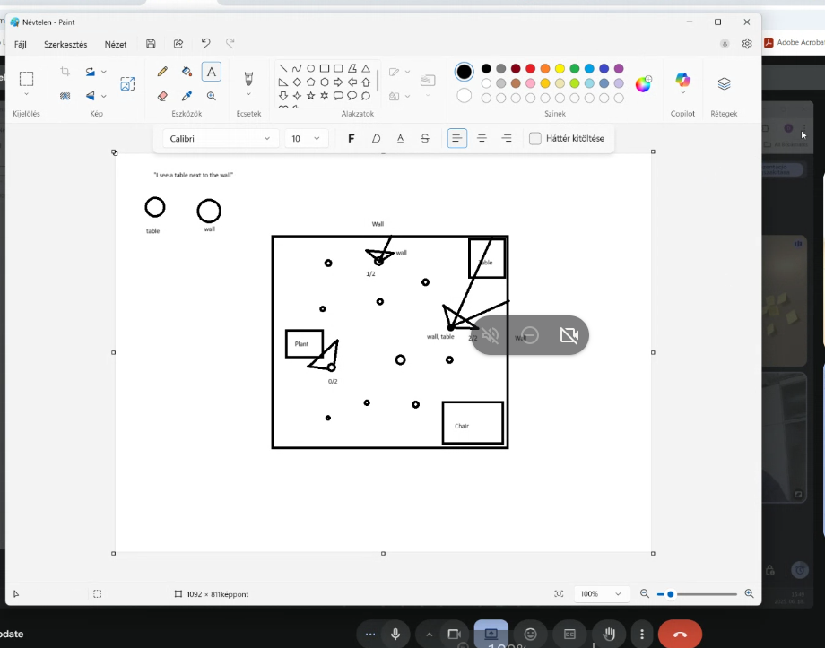

June 10

### Files responsible for Generating processed data
- /data_processing -------> changes in this order
    - create_text_embeddings.py
    - graph_loader_utils.py
    - graph_loader_3dssg.py

#### tried to improve training speed wih TrainV2, but it improved memory usage(instead of constant GPU hogging it incrementaly increases and decreases) but no effect on speed and GPU utilization
**Differences include:**
- *Batching logic*: train_V2.py uses improved batch slicing (e.g., skipping very small batches) and caches data in GPU tensors before processing.  
- *Memory handling*: train_V2.py pre-allocates tensors, clears them after each batch, and more carefully calls `torch.cuda.empty_cache()`.  
- *Structure*: train_V2.py reorganizes the code into smaller blocks (e.g., storing batch data, processing pairs) and includes more checks for subgraph cases.  
- *Logging*: Both have similar logging calls but train_V2.py has extra logs for batch info and memory clearing.

#### Eval.py basically calls the functions from train.py

### Files for training 
- train.py

## PLAN for now
Algorithm:
1. We obtain the scene graph and the text graph (CLIP embedding on the nodes, we do not need YET the edges).
2. Calculate cosine similarity between all nodes in the scene and text graphs.
3. Threshold the similarities to obtain potential matches.
4. Initialize particle filter with 3D poses (2D position + 1D rotation around vertical axis)
5. Iterate through all nodes in the text graph:
      5.1 Check, using ray-casting with the current camera parameters (particle state) and the 3D mesh, which particles see a similar node (as determined previously in 3.)
      5.2 Update the probability distrubition.
      5.3 Check the next object in the text graph.

How particle filter works:
- You initialize the particles inside the scene with some 2D position and orientation around the vertical axis.
- You calculate particle score (if a particle sees an object from the text graph -> +1).
- Particle is basically a camera. You check whether it sees an object by:
      - Putting a camera, given the particle state, in the 3D mesh.
      - Running ray-casting, to check for each pixel, what the particle sees.
      - From the 3D scene graph, you know which part of the mesh belongs to which object instance.
      - Maybe instead of 3D particle (2D position + orientation), use only 2D position and a 360 FoV camera (spherical camera) projection.

### Step of Action
- Created a new file **inference.py**, it should supposedly handle doing the following tasks:-
    -  We obtain the scene graph and the text graph (CLIP embedding on the nodes, we do not need YET the edges).
    - Calculate cosine similarity between all nodes in the scene and text graphs.
    - Threshold the similarities to obtain top 5 potential matches.

Problems:
 - currently there are no direct inference helper script

 ### Particle Filter in one interation 
 

- Initialize random points
- Check how many objects from the Text graph you can see from that random point (give objects based on the point) (give a score based on how many objects are visible)
- Later on can create a score, with percentage of object visble (how many points of an object are visible compared to all the points)